# MonFit

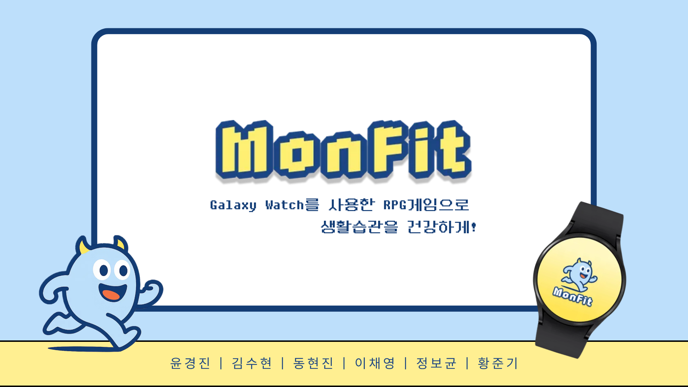

## 1. 프로젝트 개요

### 개발 기간

| **개발 기간** | **2025.07.07 ~ 2025.08.17 (6주)** |
| --- | --- |

### 팀원 소개

| **팀원** | **역할** |
| --- | --- |
| 윤경진 | Team leader / AI / Android |
| 김수현 | Design / Android |
| 이채영 | Design / Android  |
| 정보균 | Unity / AR |
| 동현진 | BE / CICD |
| 황준기 | BE / 영상 |

### 기획 의도

| [**2020년부터 2023년까지 스마트 워치 보유율 36.2% 증가**](https://www.newsian.co.kr/news/articleView.html?idxno=68037) |
| --- |
| [**한국인 수면 시간, OECD 평균보다 18% 부족**](https://medicalworldnews.co.kr/m/view.php?idx=1510966268&mcode=) |
| [**러닝인구 1000만’ 주장 무색… “성인 70%, ‘숨차는 운동’ 안 한다.”**](https://www.hankookilbo.com/News/Read/A2025071115520004738) |
| [**SSAFY 내부 설문 결과 요약(2025.08)**](https://docs.google.com/forms/d/1cOG3YJwhA0hgO4US9gjbacrB4CzumUBCrftb91N6Y8E/viewanalytics?pli=1&pli=1) |

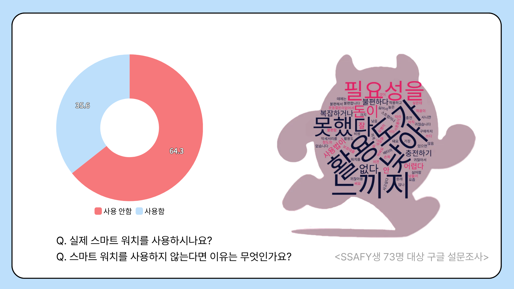

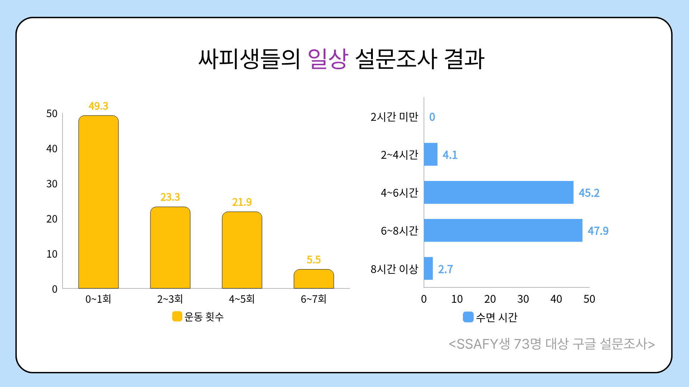

### 목표

| **헬스 데이터**를 기반으로 스탯을 결정하는 **갤럭시 워치** 연동 게임으로,일상에서 **건강한 습관 형성**을 유도한다. |
| --- |
| **워치 제스처 모션 인식** 전투로 동적 플레이를 구현하고, **갤럭시 워치의 활용도**를 높인다. |

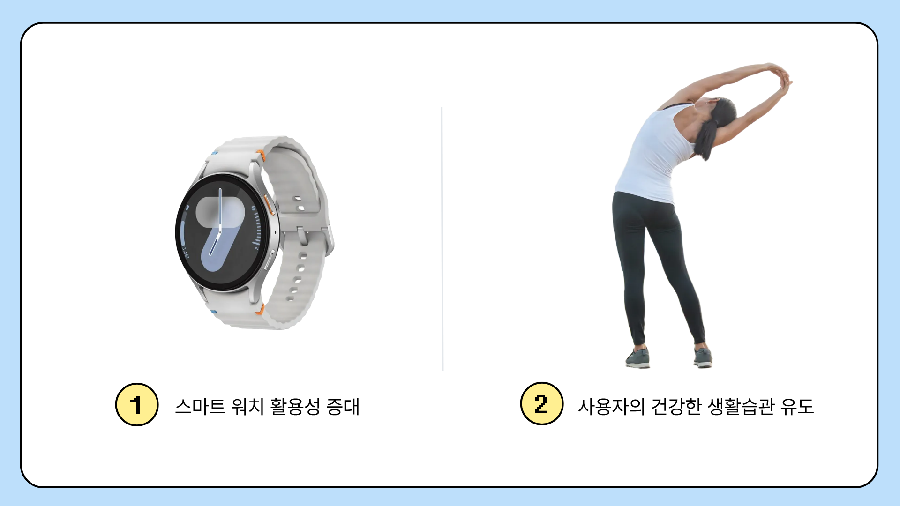

---

## 2. 서비스 기능 소개

- 삼성 헬스 커넥트 연동

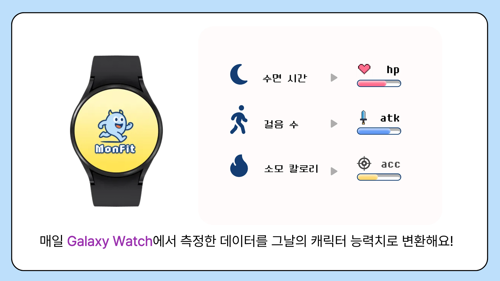

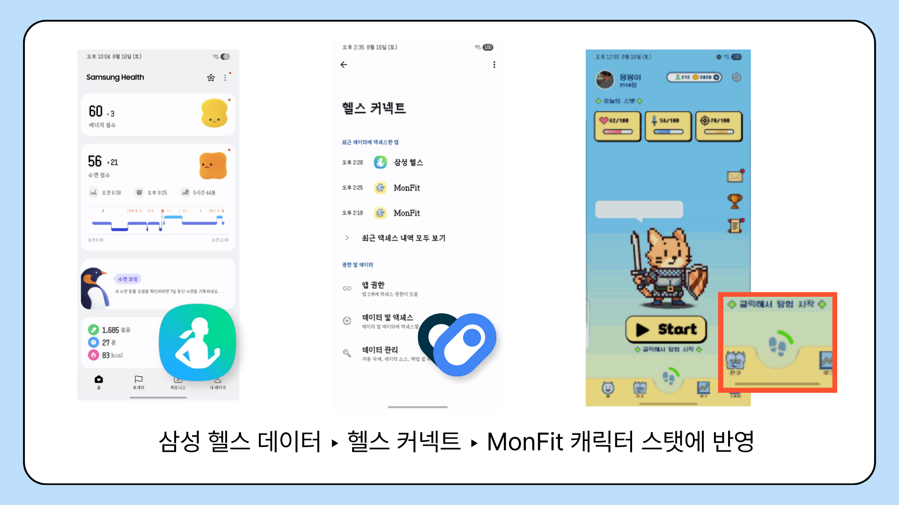

- 활동 로그

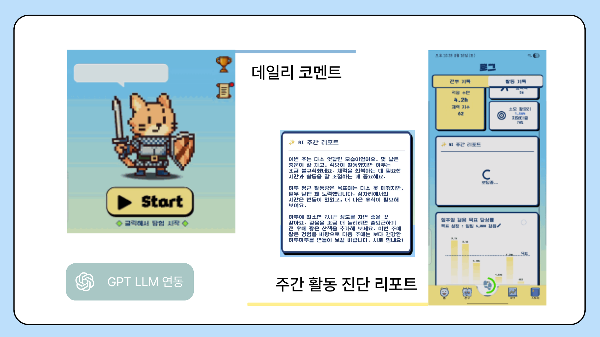

- 모험 시스템

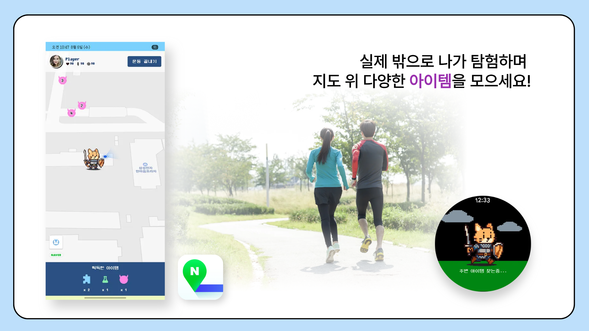

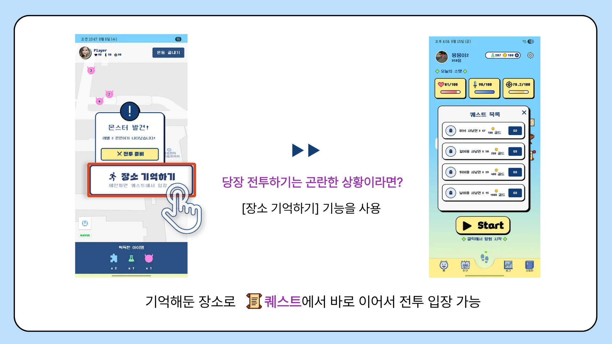

- 친구 기능

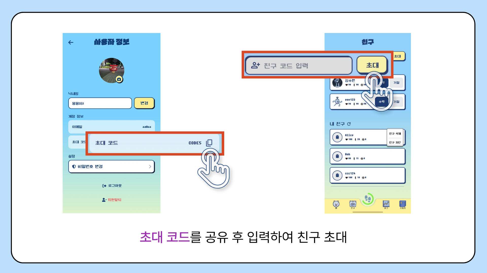

- 친구와 대결 시스템

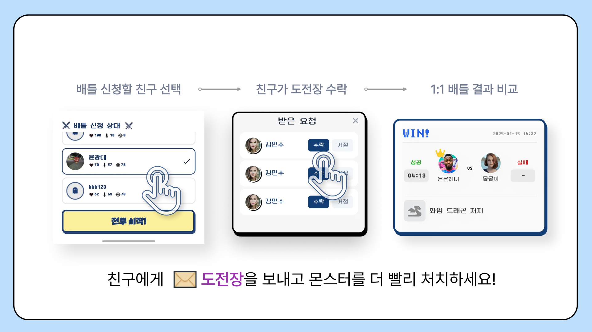

- 몬스터 종류

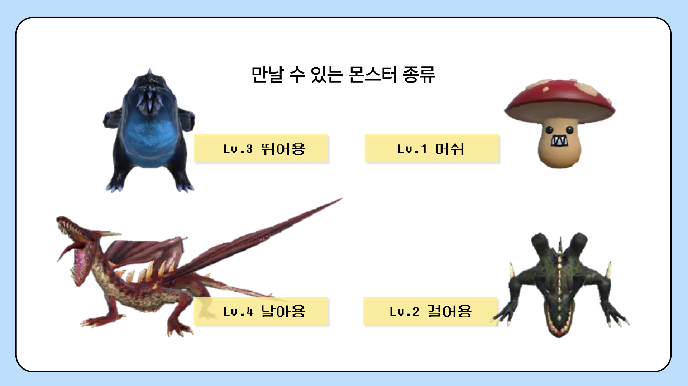

- 랭크 시스템

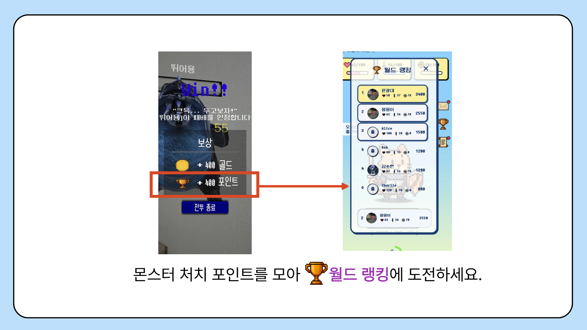

- **그외 기능**  
스토리 도감, 아이템 상점, 친구 초대, 내 활동 로그 보기(일주일 단위), 내 배틀 로그 보기, 효과음 및 배경음 볼륨 설정, 구글 소셜 로그인 연동, 이메일 인증으로 회원가입,  
튜토리얼 온보딩 화면, 실시간 걸음수 프로그래스바

## 3. 아키텍쳐

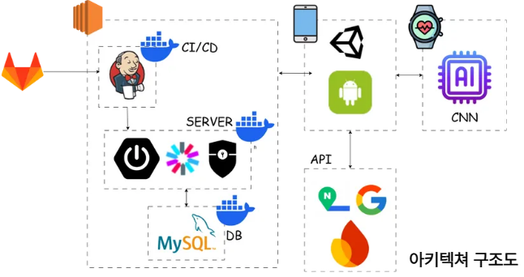

---

## 4. 주요 기술 스택

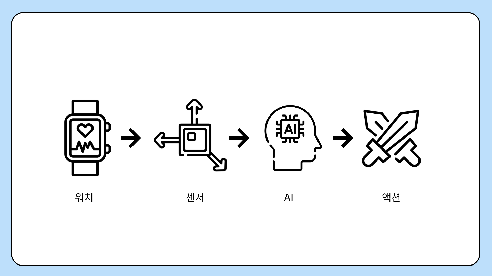

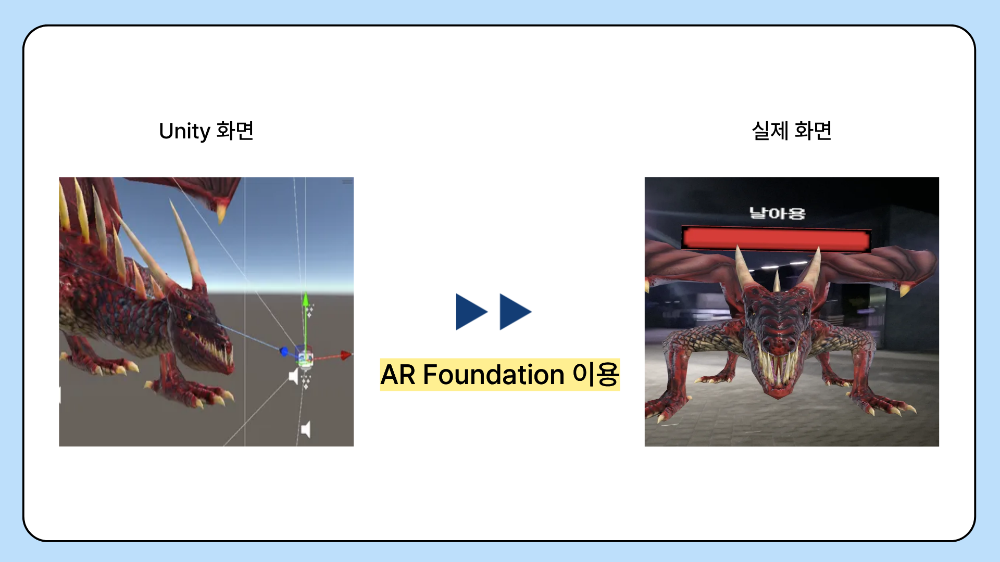

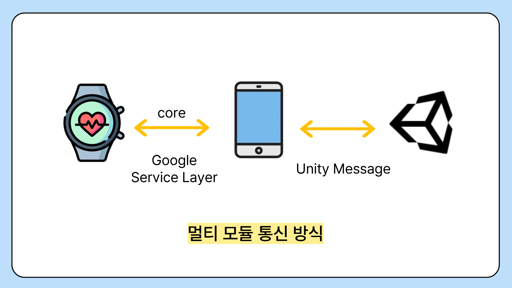

| 구분 | 사용 기술 |
| --- | --- |
| **Android** | Compose, Android View System, Retrofit |
| **Backend** | Spring Boot, MyBatis, Swagger UI |
| **Database** | MySQL, Fire base |
| **AI** | PyTorch, OpenAI API, 1D CNN |
| **AR** | Unity, AR Foundation |
| **API** | Health Connect, Naver Map,  Google Play Services |
| **INFRA** | Jenkins, docker |
| **협업** | JIRA, GitLab |

---

## 5. 주요 라이브러리

### AR Foundation

유니티 프로젝트를 모바일 프로젝트에 모듈로 올려 증강 현실을 구현하기 위해 사용

Kotlin의 ARCore 보다 더욱 동적이고 세밀한 게임 로직을 짤 수 있어 사용함  

### Health Connect

삼성 헬스에 기록된 헬스 데이터를 가져오기 위해 사용

삼성 헬스 뿐만이 아니라 다양한 건강 관련 어플의 데이터를 가져오거나 우리의 어플로 데이터를 기록하는 등의 확장성이 높아 사용함

### Google Play Services

갤럭시 워치와 모바일 기기의 통신 구현을 위해 사용

BLE 방식보다 안정성이 높고 구현이 쉬워 사용함

## 6. DB 테이블

---

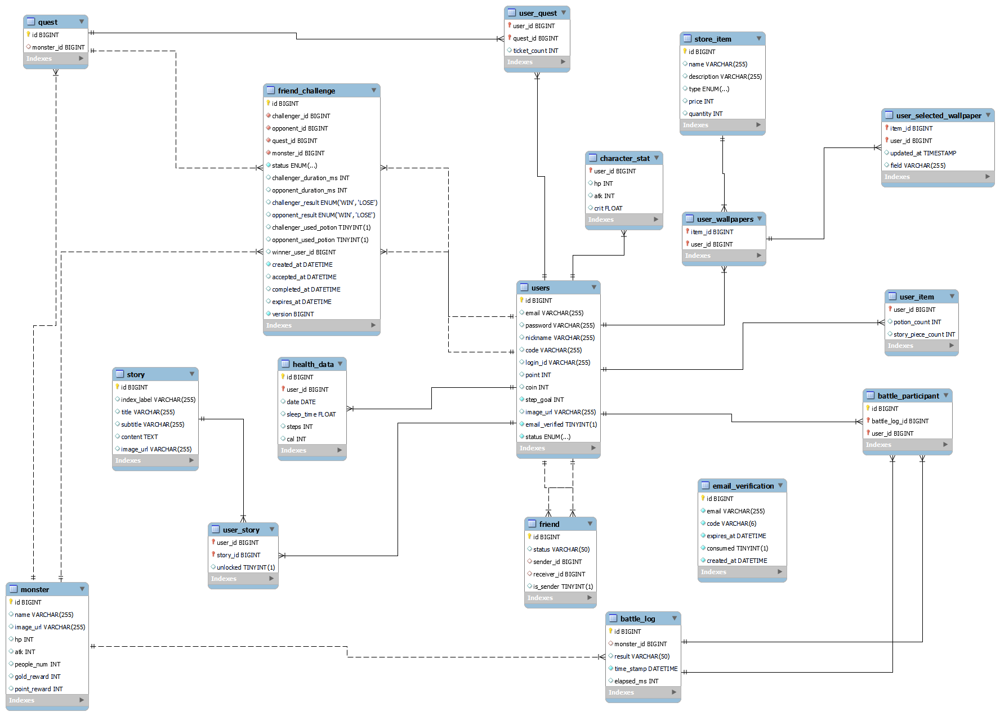

## 6. 게임 로직

1. 플레이어는 공격 3번에 한번 스킬 사용 가능.
2. 데미지는 공격력에 비례, 스킬은 공격력의 2배 데미지.
3. 치명타는 1.2배 추가 데미지.
4. 몬스터 또한 3번 공격에 한번 강한 공격 사용.
5. 몬스터가 공격하는 동안은 무적상태로 데미지 안입음.
6. 플레이어 사망 이후 물약이 있을경우 한번 부활 가능.
