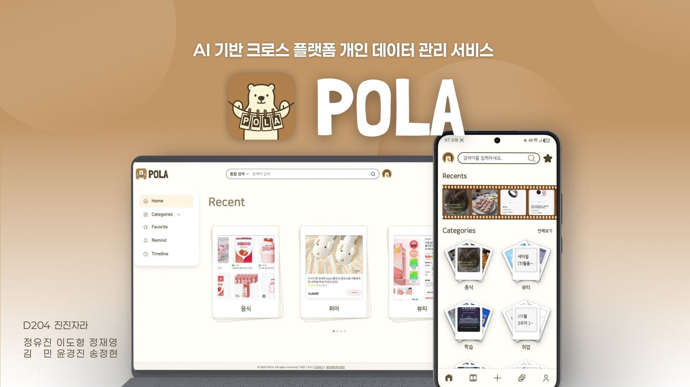
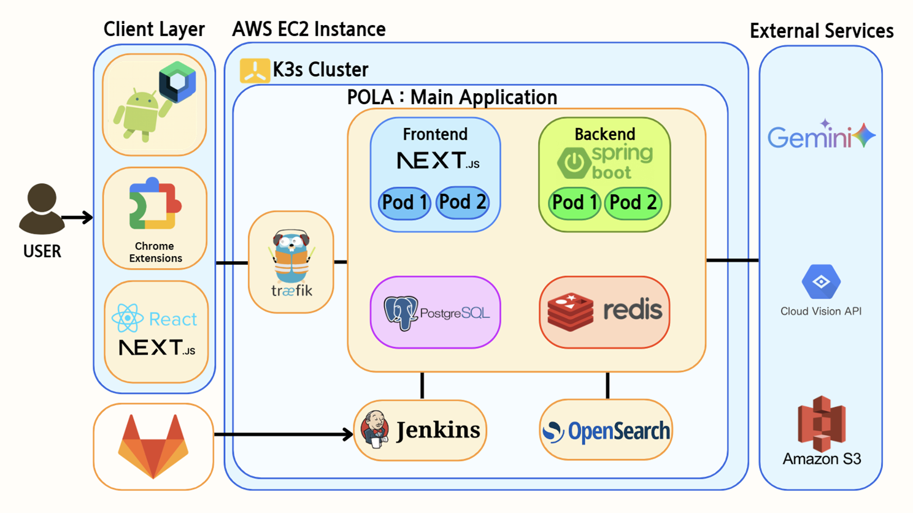
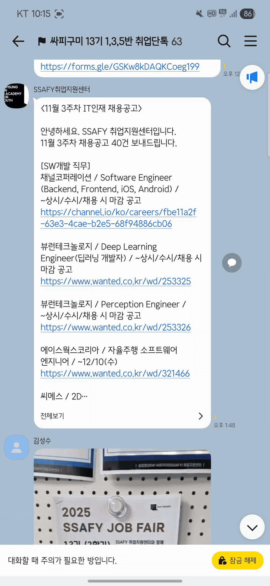
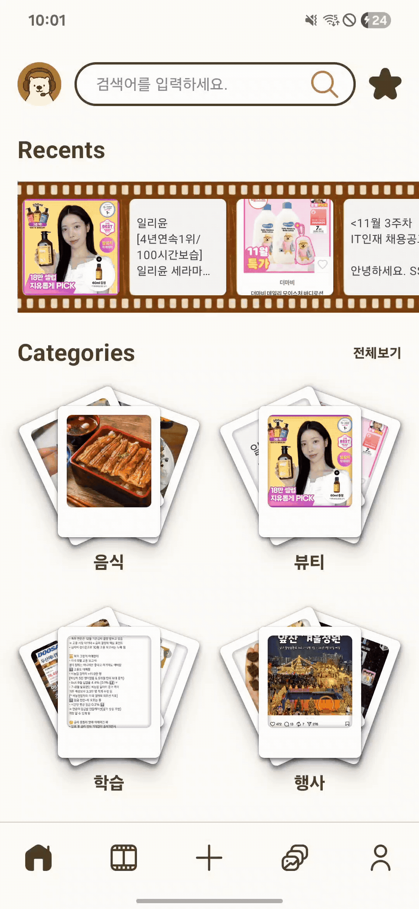
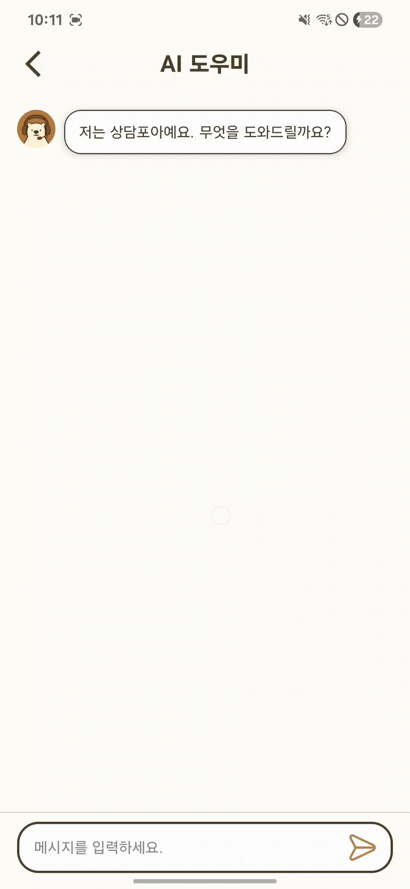
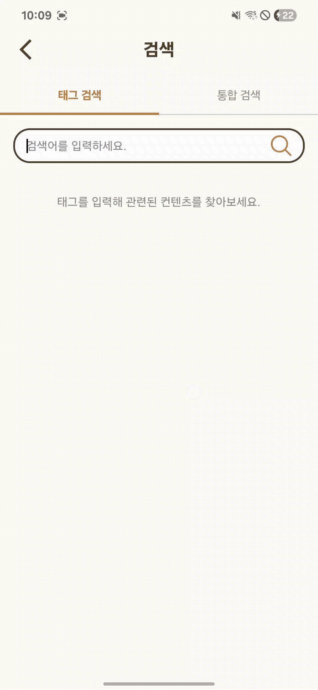
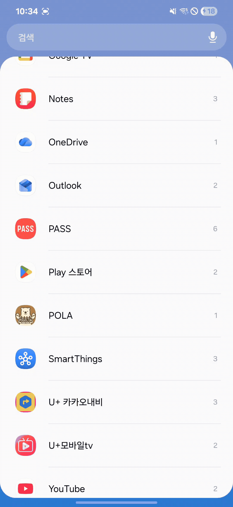
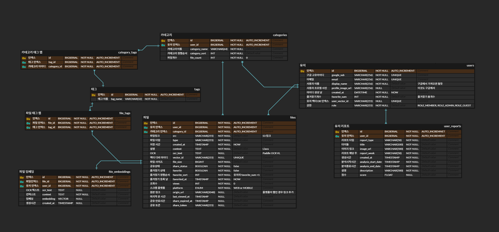
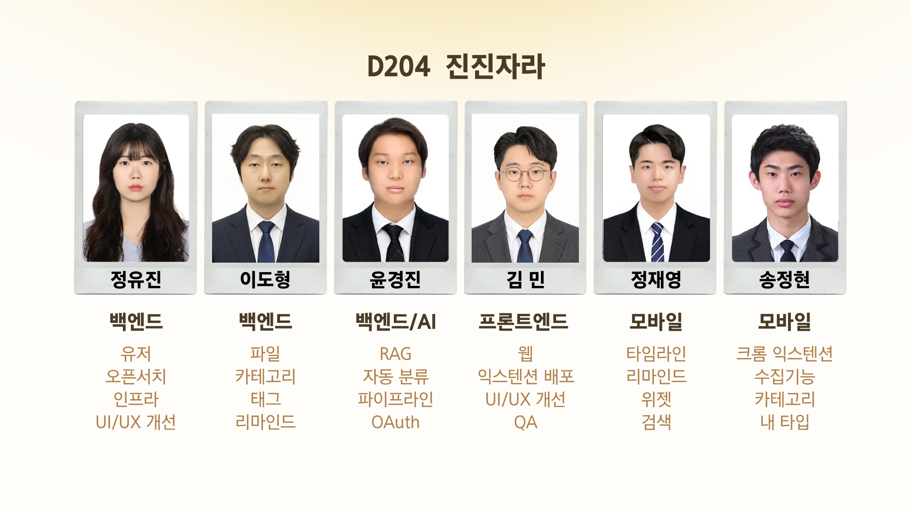

# README.md



# POLA - AI 기반 크로스 플랫폼 개인 데이터 관리 서비스

- 기간: 2025.10.10 ~ 2025.11.28
- 팀 구성/역할
    - 정유진 : 인프라, 백엔드
    - 이도형 : 백엔드
    - 윤경진 : 백엔드, AI
    - 김민 : 웹
    - 정재영 : 모바일
    - 송정현 : 모바일, 크롬 익스텐션

---

## 1. 개요

 POLA는 디지털 세대의 "저장만 하고 활용 못 하는" 문제를 해결하는 AI 기반 크로스 플랫폼 개인 지식 관리 시스템입니다.

저희의 핵심 가치는 “저장에서 끝나지 않고, 활용 까지” 입니다.  

현대인은 하루에 많은 양의 스크린 샷을 촬영하지만 다시 보기까지는 오래 걸립니다. POLA는 흩어진 디지털 정보를 자동으로 정리하고, 필요할 때 쉽게 찾아 실제로 활용할 수 있도록 돕습니다. 

### ✨ 주요 특징

- **📱 크로스 플랫폼**: 모바일·웹·크롬 확장 기반의 어디서든 가능한 손쉬운 정보 수집과 실시간 동기화
- **🤖 AI 자동 분류**: Gemini 2.5 Flash 기반 멀티모달 분석으로 이미지·텍스트를 자동 분류 및 태깅
- **🔍 한국어 최적화 검색**: Nori 형태소 분석 + Edge N-gram으로 한 글자부터 복합어까지 정확한 검색
- **💬 RAG 기반 AI 검색**: 저장한 정보를 기반으로 질문하면 답변해주는 개인 지식 비서
- **🔔 스마트 리마인드**: 랜덤 추천으로 저장된 정보를 잊지 않게 상기

### 👥 타겟 사용자

**디지털 정보를 수집하는 모든 현대인**

- 하루 10건 이상 스크린샷을 촬영하는 스마트폰 사용자
- 웹 서핑 중 유용한 정보를 수집하는 직장인, 학생, 연구자
- "나중에 볼 것 같아서" 저장하지만 실제로는 다시 보지 않는 사람들
- 여러 플랫폼(SNS, 블로그, 유튜브 등)에서 정보를 수집하는 멀티채널 사용자

### 🎨 서비스 컨셉

**"가장 사적인 스마트 스크랩북"**

 나만의 디지털 서랍에 자유롭게 정보를 저장하고 활용하는 완전히 개인화된 지식 관리 공간입니다.

**📱 플랫폼**

: Android 모바일 앱 / Next.js 웹 / Chrome 확장 프로그램

**🛠️ 주요 기술**

: Spring Boot, K3s, PostgreSQL, Redis, OpenSearch, Google Cloud AI (Gemini 2.5 Flash, Vision AI)

---

## 2. 기획 의도 / 배경

현대인들은 뉴스 기사, 맛집 정보, 마음에 드는 물건 등을 좋아요, 다운로드, 북마크 등으로 저장한다.

하지만 이렇게 **저장 경로가 분산** 되면 중요한 정보가 어디에 저장되어 있는지 잊어버리게 된다.

더해서 정리가 잘 되어 있어도 데이터가 많아지면 **찾기 힘들**게 된다.

이 상황에서 데이터를 더 **쉽게 수집**하고 **자동으로 정리**되며 **찾기도 쉽게** 하기 위해 POLA를 기획하게 되었다.

### "이런 경험, 있으신가요?"

- 📱 유용한 정보를 스크린샷으로 찍어두고 **까먹음**
- 🍜 블로그에서 본 맛집 정보, 나중에 **어디 저장했는지 기억 안 남**
- 💡 업무나 공부 중 캡처한 자료, **필요할 때 못 찾음**
- 📚 하루 평균 10장 이상 스크린샷, 하지만 **다시 본 건 거의 없음**

### 빅데이터 시대, 우리는 정보를 "저장"하지만 "활용"하지는 못합니다

스마트폰과 인터넷의 보편화로 우리는 매일 엄청난 양의 정보에 노출됩니다. 유용한 정보, 영감을 주는 콘텐츠, 나중에 필요할 것 같은 자료들... '놓치기 아까워서', '언젠가 쓸 것 같아서' 우리는 끊임없이 정보를 저장합니다.

**하지만 현실은 어떤가요?**

- 📱 평균 **498개의 스크린샷**을 갤러리에 보관 중 (Mottelson, 2023)
- 🔍 정작 필요할 때는 **어디 있는지 못 찾음**
- 😓 일반 사진과 뒤섞여 **검색 불편**
- 💤 결국  대부분 **다시 보지 않고 방치**

위의 문제를 해결하기 위해서 POLA를 기획하였습니다. 

### POLA는

- 여러 플랫폼을 사용해도 하나로 모을 수 있다. (수집의 편리)
- 정리하기 귀찮은 점을 자동으로 분류해준다. (분류의 편리)
- 찾기 힘든 정보도 간단한 질문으로 찾아준다. (검색의 편리)

---

## 3. 프로젝트 구성

POLA 폴더 구조:

```
POLA/
├─ backend/
│  └─ pola/                         # POLA 백엔드 서버
│
├─ AI/    
│  └─ dicts/
│
├─ infra/    
│  └─ k8s/
│
├─ web/       
│  ├─ extension/                    # 크롬 확장 프로그램
│  └─ pola/                         # POLA 웹 사이트
│
├─ mobile/                                         
│  └─ Pola/                         # POLA 안드로이드 앱             
│
│
└─ README.md
```

---

## 4. 기술 스택

### ▣ Mobile

- **Android**: Jetpack Compose(Kotlin), Android SDK, Compose
- **DI**: Hilt
- **Network**: Retrofit
- **Data**: DataStore, Coroutines
- **UI/UX**: Coil, Lifecycle, ViewModel
- **Auth/Credential**: Android Credential Manager, Google Identity Services

### ▣ FE

- **Web**: Node 22, React 19, Next.js 16, React Compiler
- **UI Framework**: Tailwind CSS, lucide-react, framer-motion
- **State Management**: Zustand

### ▣ Chrome Extension

- **Language**: Vanilla JavaScript
- **Manifest**: V3
- **Chrome APIs**: Identity, Storage, Tabs, Context Menus, Notifications
- **Auth / Upload**: OAuth 2.0, JWT, S3 Direct Upload
- **Canvas / Interaction**: Canvas API, Drag & Drop API

### ▣ BE

- **Language**: Java 21
- **Framework**: Spring Boot 3.5.7
- **Spring**: Spring Security(OAuth2 + JWT), Spring Data JPA, Spring Web(REST API)
- **문서화**: Swagger(SpringDoc OpenAPI)
- **Cache / Search**: Redis, OpenSearch

### ▣ AI

- **Vertex AI(Gemini, text-multilingual-embedding-002)**
- **Cloud Vision API**

### ▣ Infra

- **CI/CD**: Jenkins, GitLab
- **Container**: Docker
- **Orchestration**: Kubernetes(K3s)
- **Proxy / Routing**: Traefik

---

## 5. 아키텍처



---

## 6. 주요 기능

### 6-1. 멀티 플랫폼 업로드

- 모바일 앱 공유기능
- 웹 로컬 업로드
- Chrome 확장
    - 우클릭 업로드
    - 캡처 업로드
    - 이미지/텍스트를 드래그하여 업로드


    
 |  |  | 
---|---|---|

---

### 6-2. 유사도 기반 자동 분류

- OCR
- 요약 텍스트 생성
- 태그 생성
- 카테고리 자동 분류


 |  |
---|---|

---

### 6-3. RAG 챗봇

- 개인 데이터 기반 챗봇 시스템
- 질문 의도에 따라 질의, 추천, 비교, 리포트 가능
- 응답과 함께 근거가 되는 자료 제출




---

### 6-4. 검색

- OpenSearch 기반 검색 시스템
- 태그 검색
    - 복합어 부분 검색
    - 자동 완성
- 통합 검색
    - 태그 + 설명 + OCR 결과 종합 검색



    

---

### 6-5. 파일 공유

- 만료되는 공유링크 생성
- PresignedURL 기반 접근 제어


---

### 6-6. 리마인드

- 사용자가 오랫동안 보지않은 데이터를 리마인드
- 모바일에서는 위젯으로도 조회 가능


 |  |
---|---|

---

### 6-7. 기타

- 타임라인
- 수집타입


 |  |
---|---|

---

## 7. ERD



---

## 8. 트러블 슈팅

### 정유진

- **문제**
    - K3s 전환 시 Pod 2개가 동시 종료되어 서비스 중단 발생
    - "대학생가방" 검색 시 "회사원가방" 등 불필요한 결과 포함 (검색 정확도 25%)
    - 웹/모바일 동시 지원 시 CORS 충돌, 인증 플로우 차이
- **원인**
    - K3s Rolling Update 설정 누락 (`maxUnavailable`, Readiness/Liveness Probe 미설정)
    - Standard Analyzer의 한계 (한국어 형태소 분석 불가, 공백 기준 토큰화)
    - 모바일 백엔드 중심 개발로 인한 웹 플랫폼 보안 요구사항 차이 미고려
- **해결**
    - **K3s 무중단 배포**
        - Rolling Update 전략(`maxUnavailable: 0`, `maxSurge: 1`)과 Spring Boot Actuator 기반 Readiness/Liveness Probe 설정으로 새 Pod 준비 완료 후 기존 Pod 종료 보장
    - **한국어 검색 정확도 개선**
        - Nori 형태소 분석기로 복합어를 분해하여 AND 검색, Edge N-gram으로 한 글자 검색 및 자동완성 지원, 검색어 토큰 수에 따라 OR/AND 전략 동적 적용
    - **CORS 및 인증 통합**
        - Spring Security에서 CORS를 필터 체인 최상단에 배치하고, `allowCredentials(true)`와 명시적 Origin 설정으로 웹/모바일 Cookie 기반 인증 지원

---

### 이도형

- **문제**
    - 한 화면에 여러 이미지가 동시에 로딩될 경우, 이미지 표시 속도가 지나치게 느려져 사용자의 경험이 크게 저하되는 문제가 발생했다.
- **원인**
    - 모든 화면에서 원본 이미지를 그대로 불러오고 있었다.
    - 원본 파일은 고해상도·대용량이라 네트워크 비용이 높아 로딩 시간이 오래 걸릴 수밖에 없는 구조였다.
- **해결**
    - 상세 조회가 아닌 여러 이미지를 리스트 형태로 보여주는 화면에서는 **미리보기(Preview) 이미지**를 우선 로딩하도록 구조를 변경했다.
    - S3에 데이터가 업로드되면 AWS Lambda에서 이벤트를 감지해 Sharp 라이브러리로 이미지를 자동 리사이징하고 품질을 조정해 **용량을 약 45배 감소**시켰다.
    - 그 결과, 리스트 화면의 로딩 속도를 **약 10배 개선**했으며 전체적인 사용자 경험을 크게 향상시켰다.

---

### 윤경진

- **문제**
    - 사용자의 질문 의도와 거리가 멀어 보이는 정보들이 함께 제출되거나 아예 출력이 나오지 않았다.
- **원인**
    - 데이터에 따라 임베딩 된 정보의 양이 달랐다.
    - 사용자의 질문 텍스트와 비교를 하기 때문에 사용자의 질문 방식에 따라 결과가 달랐다.
    - 의도가 멀어 보이는 데이터도 그렇지 않아 보이는 데이터와 유사도 차이가 크지 않았다.
- **해결**
    - RAG의 출력을 허용하는 유사도 기준점을 유동적으로 조절할 수 있는 전략을 사용했다.
    - 가장 높은 유사도를 가진 데이터를 기준으로 기준점을 재 설정하는 전략을 사용했다.
    - 질문 의도를 라우팅하여 각각 다른 기준점을 적용했다.
    - 결과 사용자의 의도에 맞게 데이터들을 제시할 수 있게 되었다.

---

### 김민

- **문제**
    - 각 페이지를 이동할 때 마다 상태가 초기화되는 문제가 발생했다.
    - 검색의 자동 완성 기능이 무조건 선택이 되는 문제가 발생했다.
    - 로그인 상태 유지가 되지 않는 문제가 발생했다.
- **원인**
    - 같은 layout을 사용하는 것이 아닌 각자 다른 layout을 생성해서 상속 받아 사용했었다.
    - 검색에서 키 입력을 받을 시 자동 완성 항목 중 1번을 선택하도록 되어있었다.
    - 쿠키로 반환받는 리프레시토큰이 http 환경에선 받아올 수 없는 근본적인 문제가 있었다.
- **해결**
    - ()를 사용한 라우팅 그룹을 활용하여 하나의 layout을 사용하였고, 상태가 초기화되지 않았다.
    - 키 입력을 받은 후 방향키의 조작이 없을 시 자동 완성 컨텐츠를 선택하지 않도록 했다.
    - 배포 서버에 올려서 문제가 없는 것을 확인했다.

---

### 정재영

- **문제**
    - 리마인드 스크린의 스와이프 전환 애니메이션이 부자연스러운 문제가 발생했다.
    - OAuth 로그인 후 사용자의 카테고리 설정 여부에 따라 화면을 분기하는 로직에서 오류가 발생했다.
- **원인**
    - 리마인드 카드를 뒷 부분에 쌓아놓는 방식을 사용했는데, 그림자 효과를 넣으면서 숨겨 놓은게 표시되었다.
    - 토큰 저장과 온보딩 상태 관리가 분리되어 있지 않아, 로그아웃 시 토큰만 삭제되고 온보딩 상태는 남아있어 다음 로그인 시 분기 로직이 잘못 작동했다.
- **해결**
    - 리마인드 카드를 화면 바깥에 배치해놓고 불러오는 방식을 사용하여 자연스러운 전환 애니메이션을 구현할 수 있었다.
    - 로그아웃 시 토큰과 온보딩 상태를 함께 초기화해서 사용자 정보 및 카테고리 설정 여부를 확인한 뒤 최종 상태를 결정하도록 개선했다.

---

### 송정현

- **문제**
    - (모바일) 하단 네비게이션 바를 조건부로 숨기는 기능을 추가한 직후부터 Upload 화면으로 이동할 때 앱이 갑자기 비정상 종료되는 현상이 발생했다.
    - (크롬 익스텐션) 화면 중앙에 있는 이미지나 텍스트를 드래그할 때 드롭존이 콘텐츠를 가려버려 기능이 동작하지 않았다.
    - (크롬 익스텐션) 로그인한 지 오래된 상태에서 콘텐츠 수집 기능을 사용하면 동작하지 않았고, 화면에는 여전히 로그인 상태로 표시되어 혼란스러웠다.
- **원인**
    - Compose Recomposition과 Kotlin 초기화 순서 간의 타이밍 이슈로, 타이밍에 따라 items 리스트가 null을 반환했다.
    - 드롭존 생성 시 콘텐츠의 위치를 전혀 고려하지 않고 무조건 중앙에 배치하는 정적인 구현 방식이었다.
    - 저장된 액세스 토큰의 유효성을 앱 시작 시에만 검증했고, 수집 기능 사용 시에는 토큰 검증 없이 API를 호출하는 구조였다.
- **해결**
    - companion object의 items를 `by lazy`로 변경하여 지연 초기화를 적용하고, Thread-safe한 초기화로 Recomposition 중에도 안전하게 동일한 인스턴스를 반환할 수 있게 했다.
    - 드래그 시작 시 콘텐츠의 위치를 파악하고 사각형 충돌 알고리즘으로 겹침을 계산하여, 충돌이 감지되면 드롭존을 자동으로 오른쪽으로 이동시켜 콘텐츠와 드롭존 모두 명확하게 보이도록 개선했다.
    - API 응답으로 401 상태 코드를 받았을 때 자동으로 토큰 갱신 및 재로그인을 처리하도록 로직을 추가했다.

---

## 9. 회고

### 정유진

- **배운 점**
    
    **기술적 역량**
    
    - **Kubernetes 생태계를 이해했다**: Pod, Deployment, Service, Ingress의 관계와 Rolling Update 메커니즘을 실전에서 경험했다
    - **검색 엔진 최적화 능력을 습득했다**: OpenSearch의 Analyzer 조합을 통한 언어별 검색 전략을 수립했다
    - **보안 설계 기본기를 확립했다**: OAuth2, JWT, CORS 등 웹 보안의 핵심 개념과 플랫폼별 차이를 이해했다
    - **문제 해결 프로세스를 체계화했다**: 원인 분석 → 가설 검증 → 단계적 해결의 접근법을 확립했다
    
    **프로젝트 관리**
    
    - **팀 리더십을 발휘했다**: 6명 팀원의 강점을 파악하고 역할을 분담했으며, 주 2회 회의로 소통 체계를 구축했다
    - **문서화 습관을 들였다**: README, API 명세, 아키텍처 다이어그램을 작성하여 팀 생산성을 향상시켰다
    - **우선순위를 관리했다**: MVP 기능 중심 개발로 7주 내 서비스를 완성했다
    
    **개인적 깨달음**
    
    - "완벽한 설계"보다 **"빠른 검증과 개선"**이 더 효과적임을 체감했다 (K3s 실패 → Rolling Update 학습)
    - "동작하는 코드를 먼저, 개선은 나중에"의 중요성을 깨달았다 - 모든 성장은 실패 경험에서 시작되었다
    - 기술력만큼 "소통 능력"이 중요함을 배웠다 - 팀원들이 이해해야 협업이 가능했다
    - 인프라는 **"단계적으로 복잡도를 높여야"** 문제 격리가 쉬움을 경험했다
- **아쉬운 점**
    
    **기술적 측면**
    
    - **테스트 커버리지가 부족했다**: 일정 압박으로 단위 테스트 작성이 미흡했다 (목표 80% → 실제 40%)
    - **모니터링 시스템을 구축하지 못했다**: Prometheus + Grafana를 계획했으나 시간 부족으로 미구현했고, 장애 발생 시 로그를 수동으로 확인해야 했다
    - **초기 인프라 설계 순서를 실수했다**: Traefik을 먼저 도입해 디버깅 시간을 낭비했다 (기본 배포 검증 후 Ingress 적용이 효율적이었을 것)
    - **기술 학습 시간이 부족했다**: K3s, OpenSearch 등 새 기술을 충분히 학습하지 않고 바로 적용했다
    
    **프로세스 측면**
    
    - **코드 리뷰가 부족했다**: 개발 속도를 우선시하여 코드 리뷰를 생략했고, 기술 부채가 누적되었으며 코딩 컨벤션 통일이 미흡했다.
    - **일정 여유가 부족했다**: MVP 기능에 집중하느라 후순위 작업이 밀렸다 (테스트 자동화, 성능 최적화)
- **다음 개선**
    
    **기술적 개선**
    
    - **관측 가능성을 강화하겠다**: Prometheus + Grafana로 실시간 모니터링을 구축하고, Loki로 중앙 집중식 로깅을 구현하겠다
    - **테스트를 자동화하겠다**: Jacoco로 단위 테스트 커버리지 80% 이상을 달성하고, Cypress로 E2E 테스트를 CI/CD에 통합하겠다
    - **성능을 최적화하겠다**: HPA(Horizontal Pod Autoscaler)를 적용하고, Redis 캐싱 전략을 고도화하겠다
    
    **프로세스 개선**
    
    - **TDD를 실천하겠다**: 테스트 주도 개발로 코드 품질을 향상시키고 리팩토링 안정성을 확보하겠다
    - **코드 리뷰 문화를 정착시키겠다**: PR 템플릿과 리뷰 가이드라인을 수립하고, 주 2회 이상 코드 리뷰를 필수화하겠다
    - **기술 학습 시간을 확보하겠다**: 프로젝트 초기 1주일을 기술 스택 학습과 PoC에 투자하겠다
    
    **팀 협업 개선**
    
    - **페어 프로그래밍을 시도하겠다**: 복잡한 기능 개발 시 2인 1조로 진행하여 지식을 공유하고 버그를 감소시키겠다
    - **기술 공유 세션을 운영하겠다**: 주 1회 팀원들이 학습한 기술을 공유하여 전체 역량을 향상시키겠다

---

### **이도형**

- **배운 점**
    - 원본 이미지를 불러오는 구조가 기능적으로는 문제가 없지만, 실제 사용자의 환경에서는 서비스 경험을 크게 해친다는 사실을 느꼈다.
    - 어떤 구조나 기술도 장·단점이 있지만, 결국 기술의 가치는 사용자의 불편을 해결하는 데 있다는 점을 깨달았다.
    - 작은 디테일 하나가 전체 서비스의 완성도를 크게 끌어올릴 수 있다는 것을 배웠다.
- **아쉬운 점**
    - 개발 초기에 데이터베이스 Entity 구조를 충분히 확장 가능하게 설계하지 못해 서비스 중반에 스키마를 다시 고쳐야 했다는 점이 아쉬웠다. 이 과정에서 관련된 API와 서비스 로직도 함께 수정해야 해 영향 범위가 예상보다 훨씬 컸다.
    - 동일한 기능을 웹과 모바일에서 공유하는 구조였음에도 두 환경이 실제로 원하는 화면 구성과 UX 흐름이 서로 달라 요구사항을 조율하는 데 많은 시간이 들었다. 한쪽에 맞추면 다른 쪽에서 불편해지는 문제가 반복되는 점도 아쉬웠다.
    - 초반 설계 단계에서 다양한 사용 사례와 플랫폼별 UX 차이를 충분히 고려하지 못했다는 점이 아쉬웠다.
- **다음 개선**
    - 초기 설계 단계에서 기능 요구사항뿐 아니라 **모바일·웹 플랫폼별 경험 차이**까지 함께 고려해, 중간에 구조를 크게 변경하지 않아도 되는 유연한 설계를 만들고자 한다.
    - 데이터 모델링과 API 설계에서도 플랫폼마다 필요한 정보가 다를 수 있음을 고려해, 공통 구조에 필요한 경우 확장할 수 있는 형태를 적용하고자 한다.
    - 실제 구현 전, Mock 기반 화면을 먼저 구성해 UX 충돌을 조기에 발견하고 개발 후반에 구조 변경이 발생하는 리스크를 줄이고자 한다.

---

### 윤경진

- **배운 점**
    - OAuth를 이용한 로그인을 공부하면서 토큰을 이용한 사용자 인증의 구조에 대해 배울 수 있었다.
    - Gemini와 Embedding 모델을 활용한 RAG를 구축하면서 임베딩 과정의 의미와 유사도 판별 원리에 대해서 배울 수 있었다.
    - 자동 분류 과정에서 사용자 카테고리를 캐싱해 보면서 자주 계산해야 하는 데이터의 캐싱의 유용함을 느낄 수 있었다.
- **아쉬운 점**
    - 현재 카테고리는 사용자가 POLA에 관심이 많이 가질수록 더 분류가 잘 되는데 결국 처음 사용자가 태그를 손수 넣어야 하는 과정이 필요 했음이 아쉽다.
    - OCR 결과를 적절히 전처리 하지 않아서 RAG 결과가 잘 나오지 않는 부분도 있는 것 같다.
    - 현재 사용자의 의도와 거리가 먼 내용이 유사도가 가장 높게 나오는 경우는 고려되어 있지 않는데, 이 부분을 위한 해결 방법을 찾지 못 했다.
- **다음 개선**
    - 사용자가 데이터의 분류가 잘못되었다고 수정했을 때 카테고리의 변화를 주는 알고리즘
    - 처음 카테고리 생성 시 관련된 태그들을 몇 개 추천해주는 기능
    - 사용자가 데이터 수정 시 그 데이터의 임베딩을 재 진행

---

### 김민

- **배운 점**
    - 오랜만에 프론트 작업을 하여서 UI를 컴포넌트화 하고 이를 배치해서 자연스럽게 만드는 과정은 생각보다 재밌었다.
    - 구글 OAuth와 크롬 확장 배포를 처음 진행해봤는데, 매우 귀중한 경험이였다.
- **아쉬운 점**
    - 해당 프로젝트가 상용화 되었을때를 단 하나도 고려하지 않은 UI/UX이기에 해당 프로젝트가 정말로 상용화가 가능한지에 대한 의문이 들 것 같다.
    - 초기의 프론트 프로젝트 구조와 후반의 구조가 크게 달라져서 보다 확실하게 구조를 잡고 개발해야할 필요성을 느꼈다.
- **다음 개선**
    - 이후 리액트로 프론트 프로젝트를 하게된다면 여전히 Next를 주로 사용할 예정이지만, 지금의 구조보다는 보다 체계화 된 구조와 재사용성을 가지도록 해볼 것이다.
    - 또한 현재는 크롬 익스텐션만 상용배포가 되어있지만, 이후에는 앱도 상용배포해보고 싶다.

---

### 정재영

- **배운 점**
    - 홈 검색바에서 AI 모드 토글을 제거하고 단순화했을 때 오히려 사용성이 향상되었다.
    - 복잡한 기능보다 명확하고 단순한 인터페이스가 더 나은 사용자 경험을 제공한다는 것을 깨달았다.
- **아쉬운 점**
    - 위젯은 XML을 사용하여 디자인을 앱 내부와 완전히 통일하지 못했다.
    - 로그인 시 타이밍 이슈가 발생하지 않도록 초기에 확실히 계획하여 구현해야할 것 같다.
- **다음 개선**
    - Pull to Refresh, 뒤로가기, 네비게이션 동작 등 앱 전반의 UX 패턴을 문서로 정리하고 시작하고 싶다.
    - 앱을 스토어에 배포 해보고 싶다.
    - 위젯을 사용자 홈 화면 배열에 따라 동적으로 뷰를 보여줄 수 있게 할 것이다.

---

### 송정현

- **배운 점**
    - 안드로이드의 Intent Filter를 활용하여 시스템 수준의 공유 기능과 통합하는 방법을 배웠다. 캡처나 텍스트 선택 시 자연스럽게 앱으로 데이터를 전달받을 수 있어, 사용자가 별도의 앱 전환 없이 즉시 콘텐츠를 수집할 수 있다는 점에서 네이티브 앱의 장점을 실감했다.
    - 크롬 익스텐션을 처음 구현하면서 웹 환경에서의 UX 설계 방식을 새롭게 이해하게 되었다. 드래그 앤 드롭, 컨텍스트 메뉴, 단축키 등 다양한 인터랙션 방식을 제공함으로써 사용자가 자신에게 편한 방식으로 데이터를 수집할 수 있도록 구현하는 과정에서, 웹과 네이티브 환경의 차이와 각각의 강점을 활용하는 법을 배웠다.
- **아쉬운 점**
    - 크롬 익스텐션의 드래그 앤 드롭 기능 구현 시 처음부터 콘텐츠 위치를 고려한 동적 배치를 설계하지 못하고, 정적인 중앙 배치로 시작했다가 충돌 문제를 발견한 후 수정하게 되었다. 초기 설계 단계에서 다양한 시나리오를 충분히 검토했다면 더 효율적으로 개발할 수 있었을 것이다.
- **다음 개선**
    - 안드로이드 앱을 구글 플레이 스토어에 배포하여 실제 사용자들의 피드백을 받아보고 싶다.
    - 사용자 행동 분석과 A/B 테스트를 도입하여 데이터 기반으로 UX를 개선하고 싶다. 어떤 수집 방식이 가장 많이 사용되는지, 사용자들이 어떤 지점에서 이탈하는지 등을 파악하여 서비스를 지속적으로 발전시키는 방법을 배우고 싶다.

---

## 10. 팀원 소개

