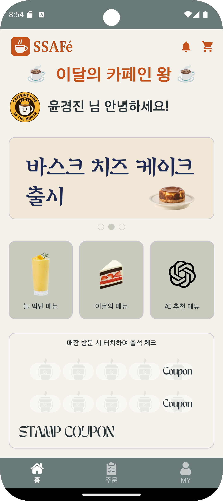
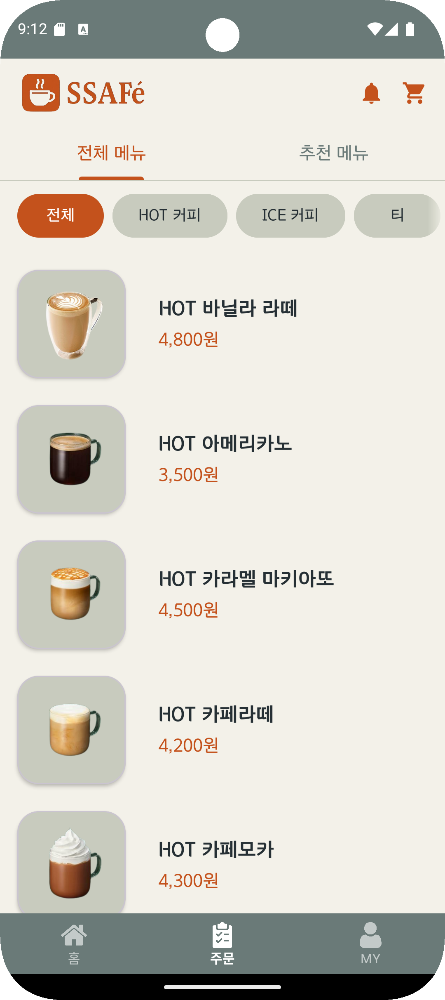
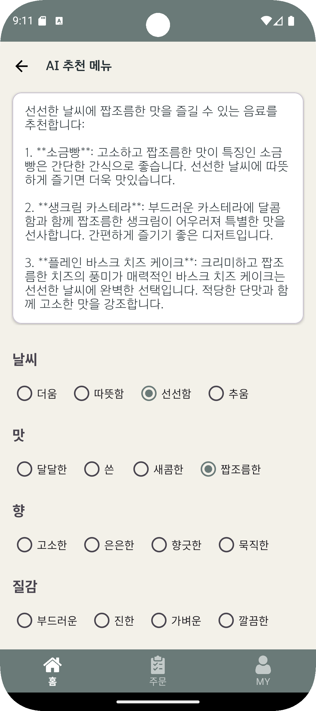
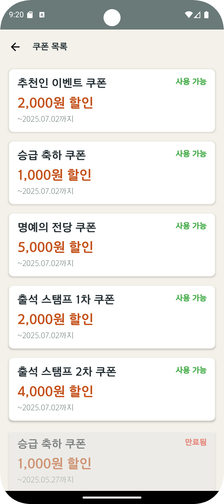
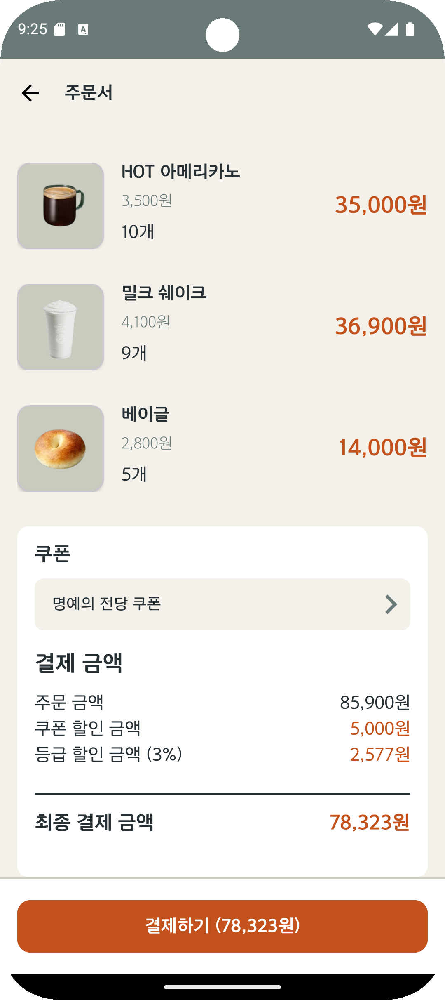
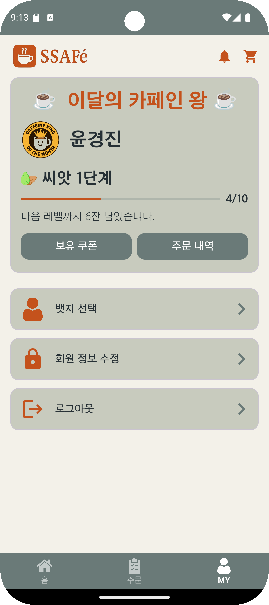
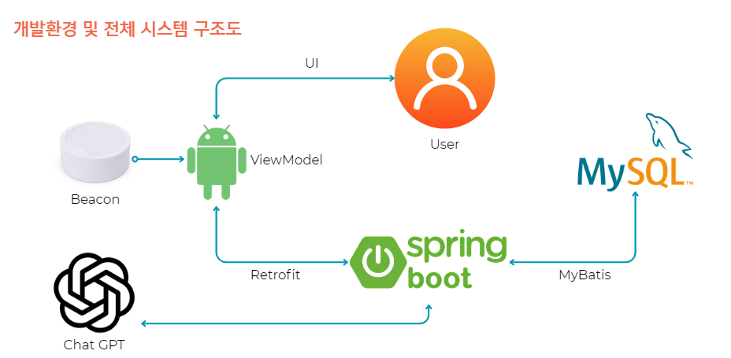

# SSAFé - 혜택 팡팡 카페 앱

<table>
<tr>
<td></td>
<td></td>
<td></td>
</tr>

<tr>
<td></td>
<td></td>
<td></td>
</tr>
</table>

### 1. 프로젝트 개요

- **프로젝트 명**: **SSAFé**
- **기간** : 2025.05.23 ~ 2025.05.27 (5일)
- **팀 구성**: 2인 팀 프로젝트
    - 윤경진 (백엔드 - Spring Boot, API 개발)
    - 정재영 (프론트엔드 - Android, UI 개발)
    - (API 연동 및 기능 구현 일부는 협업)

**SSAFé**는 Beacon 기술과 AI 추천 시스템을 기반으로, 사용자의 방문을 인식하고 맞춤형 메뉴 및 혜택을 제공하는 **개인화 카페 주문 플랫폼**입니다.

---

### 2. 기획 배경 및 목표

✔ 기획 배경

- 국내 커피 전문점 매장 수는 현재 기준 10만개가 넘었다.
- 치열한 경쟁 속에 단순 방문을 넘어 고객 맞춤형 혜택과 차별화된 경험이 필요.
- Beacon과 AI 기술로 개인화 서비스 제공 기회 확대.

✔ 목표

- Beacon 기반 출석 체크 및 쿠폰/뱃지 제공 → 고객 충성도 강화
- 주문·매출 데이터 분석 → 개인 맞춤 메뉴 추천
- ChatGPT 기반 AI 추천 기능 도입 → 취향 분석 제공
- UI/UX 개편 → 사용성 향상
- ViewModel, LiveData 적용 → 안정적 코드 구조
- SpringBoot 서버와 실시간 연동, MyBatis 활용 → 유지보수성 강화

---

### 3. 주요 기술 스택

| 구분 | 사용 기술 |
| --- | --- |
| **Frontend** | Android (Kotlin), ViewModel, LiveData, Retrofit |
| **Backend** | Spring Boot, MyBatis, Swagger UI |
| **Database** | MySQL |
| **AI 연동** | ChatGPT API |
| **하드웨어 연동** | Beacon |

---

### 4. 아키텍쳐

---

### 5. DB 테이블

| 테이블명 | 주요 컬럼 | 설명 | 제약조건 및 키 |
| --- | --- | --- | --- |
| **t_user** | id, name, pass, stamps, created_at | 사용자 정보 | PK: id |
| **t_stamp** | id, user_id, order_id, quantity | 스탬프 적립 내역 | PK: idFK: user_id → t_user.idFK: order_id → t_order.o_id |
| **t_order** | o_id, user_id, order_table, order_time, completed | 주문 정보 | PK: o_idFK: user_id → t_user.id |
| **t_order_detail** | d_id, order_id, product_id, quantity | 주문 상세 정보 | PK: d_idFK: order_id → t_order.o_idFK: product_id → t_product.id |
| **t_product** | id, name, type, price, img | 상품 정보 | PK: id |
| **t_comment** | id, user_id, product_id, rating, comment | 상품 리뷰 | PK: idFK: user_id → t_user.idFK: product_id → t_product.id |
| **t_badge_info** | id, name, img, used | 배지 기본 정보 | PK: id |
| **t_badge** | id, user_id, info_id | 사용자 보유 배지 | PK: idFK: user_id → t_user.idFK: info_id → t_badge_info.id |
| **t_coupon_info** | id, name, discount | 쿠폰 종류 | PK: id |
| **t_coupon** | id, user_id, info_id, issue_time, useable | 발급 쿠폰 | PK: idFK: user_id → t_user.idFK: info_id → t_coupon_info.id |
| **t_user_benefit** | id, user_id, issue_time, useable | 사용자 혜택 | PK: idFK: user_id → t_user.id |
| **t_sale** | o_id, total, discount, coupon_id, grade_id | 판매 내역 | PK: o_idFK: coupon_id → t_coupon.idFK: grade_id → t_grade_info.idFK: o_id → t_order.o_id |
| **t_grade_info** | id, title, unit, max_step, img, discount_percent, level_order | 등급 정보 | PK: id |
| **t_banner** | id, banner, main | 배너 정보 | PK: id |

이렇게 간단하게 가도 괜찮을 것 같음

| 테이블명 | 설명 |
| --- | --- |
| `t_user` | 사용자 정보 |
| `t_stamp` | 출석/스탬프 적립 내역 |
| `t_order` | 주문 정보 |
| `t_order_detail` | 주문 상세 |
| `t_product` | 상품 정보 |
| `t_comment` | 상품 리뷰 |
| `t_badge_info` / `t_badge` | 배지 정보 및 보유 현황 |
| `t_coupon_info` / `t_coupon` | 쿠폰 종류 및 발급 현황 |
| `t_user_benefit` | 사용자 혜택 내역 |
| `t_sale` | 판매 정보 |
| `t_grade_info` | 등급 정보 |
| `t_banner` | 이벤트 배너 관리 |

---

### 6. SSAFY Cafe REST API 요약

## 📌 전체 개요

- **Base URL:** `http://localhost:9987`
- **주요 기능:** 사용자 관리, 출석 관리, 상품, 주문, 쿠폰, 뱃지, 코멘트, 배너, 추천 등

---

## 1️⃣ User Controller (사용자 기능)

- `POST /rest/user` : 사용자 등록
- `POST /rest/user/login` : 로그인 (User 객체 + loginId 쿠키 반환)
- `GET /rest/user/logout` : 로그아웃 (쿠키 삭제)
- `GET /rest/user/isUsed` : ID 사용 여부 확인
- `GET /rest/user/info` : 사용자 정보 + 주문내역 + 등급정보 조회
- `PUT /rest/user/update` : 회원 정보 수정
- `GET /rest/user/grade` : 등급 ID로 등급 정보 조회

## 2️⃣ Daily Controller (출석 기능)

- `POST /rest/daily/insert` : 출석 정보 추가
- `PUT /rest/daily/update` : 출석 정보 초기화 (쿠폰 지급 후 리셋)
- `GET /rest/daily/get` : 총 출석 건수 반환

## 4️⃣ Product Controller (상품 기능)

- `GET /rest/product` : 전체 상품 목록
- `GET /rest/product/{productId}` : 특정 상품 정보 (댓글 포함)
- `GET /rest/product/type` : 상품 목록 반환 (타입 기준)
- `GET /rest/product/byUserId` : 사용자 구매 기반 추천 상품
- `GET /rest/product/bySale` : 매출 기반 추천 상품 (판매량 기준, 비싼순 정렬)

## 4️⃣ Banner Controller (배너 기능)

- `GET /rest/banner` : 배너 이미지 정보 조회

## 5️⃣ Order Controller (주문 및 결제 기능)

- `POST /rest/order` : 주문 저장 (Order ID 반환)
- `POST /rest/order/pay` : 주문+결제 통합 처리
- `GET /rest/order/{orderId}` : 주문 상세 내역
- `GET /rest/order/saleInfo` : 결제 내역 (금액)

## 6️⃣ Badge Controller (뱃지 기능)

- `PUT /rest/badge/update` : 사용 중인 뱃지 선택
- `POST /rest/badge/insertBadge` : 뱃지 추가
- `GET /rest/badge/used` : 사용 중인 뱃지 조회
- `GET /rest/badge/selectBadge` : 보유 중인 단일 뱃지
- `GET /rest/badge/selectAllBadge` : 보유 중인 전체 뱃지
- `GET /rest/badge/isBadgeUsed` : 뱃지 사용 여부 확인
- `GET /rest/badge/getKing` : 분야 별 뱃지 수상자

## 7️⃣ ChatGPT Controller (AI 질문 기능)

- `GET /rest/chat` : ChatGPT 질문하기

## 8️⃣ Coupon Controller (쿠폰 기능)

- `PUT /rest/coupon/update` : 쿠폰 상태 변경 (useable)
- `POST /rest/coupon/insert` : 쿠폰 추가
- `GET /rest/coupon/selectByUserId` : 사용자 보유 쿠폰 조회
- `GET /rest/coupon/selectById` : 쿠폰 ID로 조회

---

## 7. 주요 기능

- **Beacon 출석 체크**: 매장 내 Beacon 인식 → 자동 출석 → 리워드 제공
- **명예의 전당**: 목표 달성 시 뱃지 획득 및 공개
- **AI 메뉴 추천**: ChatGPT가 사용자 취향 기반으로 음료 3종 추천
- **주문/매출 기반 맞춤 메뉴 추천**
- **직관적인 UI/UX**: 사용자 흐름에 맞춘 화면 구성

---

## 8. 본인의 역할 및 기여

- DB 설계
- REST API 구현
- GPT를 활용한 메뉴 추천 구현
- 사용자 구매 이력으로 명예의 전당 및 뱃지 기능 구현
- 추천인 기능 구현
- 쿠폰과 등급 할인을 포함한 주문 내역 조회 구현

---

## 9. 개선 아이디어

- NFC 및 네이버/카카오 결제
- AI 추천에 이미지 추가 및 사용자 피드백 반영 기능 도입
- 테이블/주문 내역을 활용한 매출 통계 시각화 (차트 도입)
- 뱃지 조건 세분화 및 사용자 동기 부여 강화